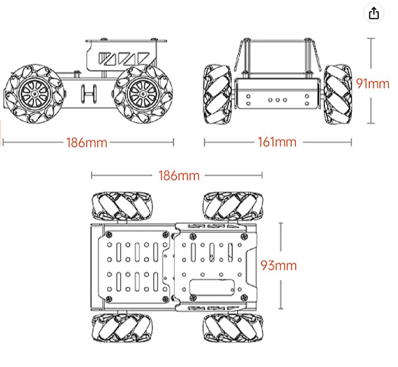
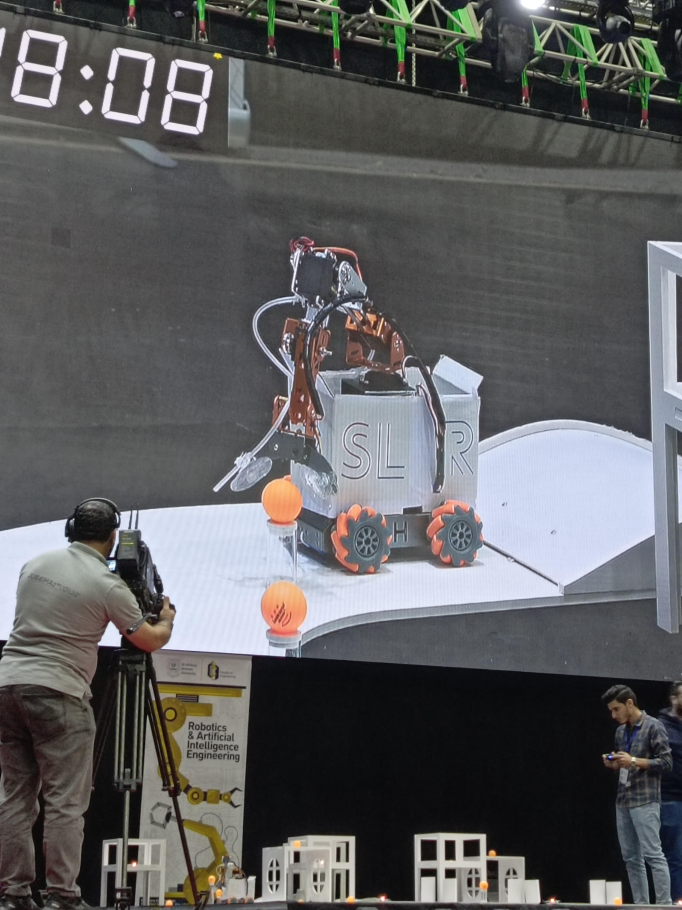
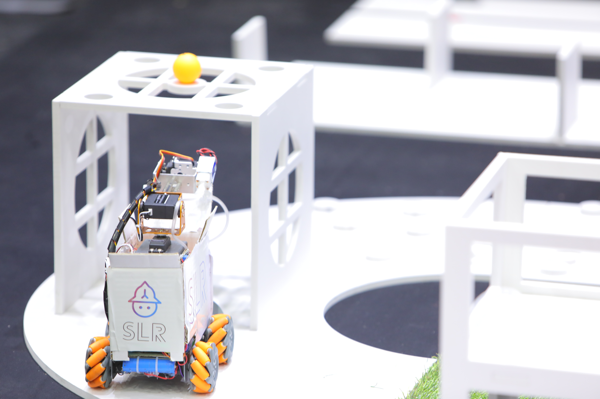
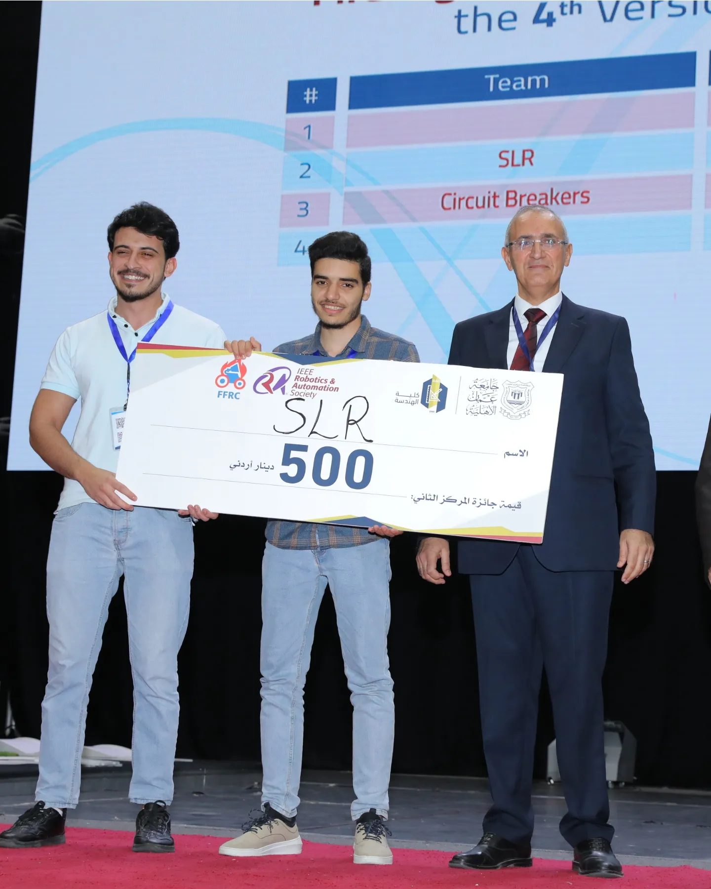

# SLR - Fire Fighting Robot


## Overview

SLR is a robot designed to participate in the Fire Fighting Robots Contest. It was engineered to complete three main tasks: collecting ping pong balls, extinguishing candles, and navigating various terrains. The robot was built with a focus on stability, versatility, and remote operation.

## Features

- **Chassis**: Robust design with four mecanum wheels for optimal maneuverability.
- **Arm**: Five degrees of freedom (5-DOF) with servo motors for precise movements.
- **Computer**: Raspberry Pi 4 B+ with Quad-core Cortex-A72 processor and 8GB RAM.
- **Remote Control**: Operated via a PS4 controller connected through Bluetooth.

## Components

### 1. Chassis



- Houses all the components.
- Equipped with four mecanum wheels for 360-degree movement.

### 2. Arm


- Features five servo motors to control each joint.
- Capable of collecting ping pong balls and extinguishing candles.

### 3. Computer


- Raspberry Pi 4 B+.
- Manages all signals and processes tasks efficiently.
- Consumes less than 500mA.

## Tasks

### 1. Collecting Ping Pong Balls



SLR collects ping pong balls to simulate rescuing people. The arm's precise movements allow it to pick up and place the balls in designated areas.

### 2. Extinguishing Candles


<!--  -->

The robot extinguishes candles to simulate remote fire suppression. The arm accurately targets and extinguishes the flames.

### 3. Navigating Diverse Terrains


<!--  -->

SLR navigates through hills, grass, and bumps using its mecanum wheels and robust chassis design.

## Challenges

- **Balance and Weight Distribution**: Initially, the robot tended to tip over due to the arm's movement. This was solved by mounting the arm in the middle of the chassis.
- **Latency Issues**: The delay between the camera and the Raspberry Pi prevented us from implementing a computer vision algorithm for autonomous fire detection.

## Achievements


- **2nd Place**: Secured 2nd place in the 4th Fire Fighting Contest, outperforming 17 other university teams.

## Team Members

- **Coach**: Dr. Abdulelah Al-Shabatat 🏆
- **Team Members**:
  - AbdulQader Dada 👨‍💻
  - Hamzeh Al-Bzour 🤖
  - Mais Belal 🌟
  - Rayan Al-mrayat 🚀

## Installation

1. Clone the repository:
   ```sh
   git clone https://github.com/Abood-devo/SLR.FireFighting.git
